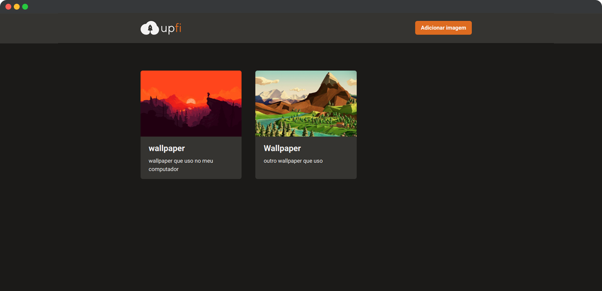

<h1 align="center">
  
</h1>

<p align="center">
  

  
</p>

<br>

<p align="center">
  
</p>

<br>

## 🧪 Tecnologias

Esse projeto foi desenvolvido com as seguintes tecnologias:

- [React](https://reactjs.org)
- [NextJS](https://nextjs.org/)
- [Chakra UI](https://chakra-ui.com/)
- [FaunaDB](https://fauna.com/)
- [ImgBB](https://pt-br.imgbb.com/)
- [React Query](https://react-query.tanstack.com/)
- [React Hook Form](https://react-hook-form.com/)
- [TypeScript](https://www.typescriptlang.org/)

## 💻 Projeto

O projeto tem como objetivo o estudo e desenvolvimento de uma aplicação em React com NextJS que utiliza a biblioteca de componentes Chakra UI que se resume em um repositório de imagens, onde você pode adicionar imagens identificadas por título e descrição.

upfi foi desenvolvido utilizando o framework NextJS utilizando o Chakra UI para montagem da interface e para questões de banco de dados, FaunaDB e ImgBB.

Este é um projeto desenvolvido como prática das aulas do Chapter IV da trilha ReactJS do **[Programa Ignite](https://www.rocketseat.com.br/ignite)** da Rocketseat.

## 🚀 Como executar

Clone o projeto e acesse a pasta do mesmo.

```bash
$ git clone https://github.com/rafaelramosdev/upfi
$ cd upfi
```

Para iniciá-lo, siga os passos abaixo:

```bash
# Instala as dependências
$ yarn

# Na raiz do projeto, no arquivo .env.local
# Preencha as variáveis ambiente de acordo com as instruções
$ .env.local

# Inicia o website
$ yarn dev
```

O website estará disponível no seu navegador pelo endereço [`http://localhost:3000`](http://localhost:3000).

## 📄 Licença

Esse projeto está sob a licença MIT. Veja o arquivo [LICENSE](LICENSE) para mais detalhes.

---

Feito by [Rafael Ramos](https://rafaelramos.dev/) 🙋🏻‍♂️
